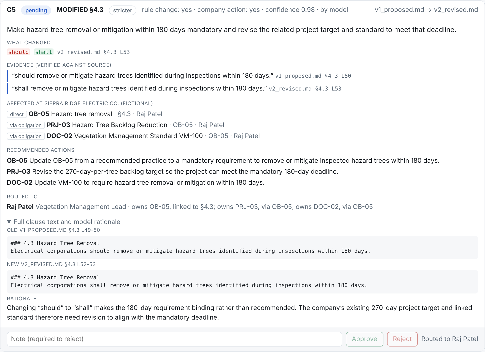

# Strata

Citation-grade regulatory change-to-action workspace. Ingests successive versions of a regulatory
proceeding, detects and cites every change, tells draft from final, maps changes to a company's
obligations, projects and documents, recommends actions with reviewer routing, escalates ambiguous
language to counsel, and keeps an append-only, tamper-evident project history with rollback.

Docs: [PRD](docs/PRD.md) · [TDD](docs/TDD.md) · [UI screenshots](ui-screenshots/README.md)



Go 1.21+, standard library only. Test data: a fictional docket (`testdata/v1_proposed.md` → `v2_revised.md` → `v3_final.md`),
a fictional utility (`testdata/company.json`) and an expert answer key (`testdata/expected_changes.json`).

## Setup

```
go test ./...                      # offline; the model is scripted, no API calls
go build -o strata ./cmd/strata
export OPENAI_API_KEY=...
export OPENAI_MODEL=gpt-6-luna     # or pass -model to each command
```

Flags go before file names and card ids. Use a new `-project` folder for each fresh run.

Or with make (`make` lists all targets):

```
make check          # vet + tests + gofmt check (offline)
make serve          # build + web UI on project ui-test/
make walkthrough    # build + the CLI walkthrough below on a new project cli-test/
make eval RUNS=3    # build + eval scorecard
make clean          # remove the binary and local test projects (keeps demo/)
```

## Quick test: web UI

```
./strata serve -project ui-test    # http://127.0.0.1:8080 (creates the project on first run)
```

1. **Ingest** `v1_proposed.md`, then `v2_revised.md` (top of the page). Each version shows DRAFT/FINAL with the quote that decided it.
2. **Changes** tab: 8 cards (C1–C8), each with the cited diff, evidence, affected obligations/projects/documents, recommended actions and who it is routed to.
3. **Ingest** `v3_final.md`: cards C9–C12. **Needs expert** filter: C11 (§5.1, "within a reasonable time") is escalated; only Sam Whitfield (counsel) can decide it.
4. **Routing**: set *Acting as* to Lena Brooks; C4 (§4.2) cannot be decided ("Routed to Raj Patel, Dana Ortiz"). Switch to Raj Patel and **Approve** C4.
5. **Obligations & tasks** tab: all obligations effective since 2026-09-10; OB-01 due 2026-11-09, citing v3 §3.3; the tasks created by approving C4.
6. **Audit log** tab: type a reason, click **Roll back here** on the event just before Raj's approval. C4 is pending again and its tasks are gone; v3 and the effective obligations stay. The undone event stays in the log, struck through.

## Quick test: command line

The same workflow without the UI. CLI and UI can share a project folder.

```
P="-project cli-test"
./strata init   $P
./strata ingest $P testdata/v1_proposed.md     # DRAFT
./strata ingest $P testdata/v2_revised.md      # cards C1–C8
./strata ingest $P testdata/v3_final.md        # FINAL -> obligations effective, cards C9–C12
./strata cards  $P
./strata show   $P C4                          # one card in full
./strata review $P -as P-03 -approve C4        # refused: §4.2 is not routed to Lena
./strata review $P -as P-02 -approve C4        # Raj approves -> tasks (event #17)
./strata state  $P                             # OB-01 due 2026-11-09, tasks
./strata log    $P
./strata rollback $P -as P-01 -to 16 -note "undo test"
./strata state  $P                             # C4 pending again, no tasks, v3 still final
./strata log    $P                             # #17 marked [undone by #18]
```

People: P-01 Dana Ortiz (regulatory affairs), P-02 Raj Patel (vegetation), P-03 Lena Brooks (PSPS),
P-04 Sam Whitfield (counsel, escalations), P-05 Priya Nair (compliance).

Things that should fail (guardrails): ingesting the same version twice; deciding a card twice;
rejecting without a note; deciding an escalated card as anyone but counsel; editing `company.json`
or an ingested version after the fact; editing any line of `<project>/events.jsonl`.

## Engine stages and evals

Stateless commands that run one stage at a time, for inspection and measurement:

```
./strata diff   testdata/v1_proposed.md testdata/v2_revised.md   # clause-level diff, cited
./strata map    testdata/v1_proposed.md testdata/v2_revised.md   # + affected company items, reviewers
./strata assess testdata/v2_revised.md testdata/v3_final.md      # + model judgment and guardrails
./strata eval -runs 3                                            # scorecard vs. the answer key
```

`-json` on `diff`, `map`, `assess`, `eval` and `state` prints the full structured output.

## Layout

| Package | Job |
|---|---|
| `internal/clause` | Parse markdown into numbered clauses with exact byte offsets |
| `internal/diff` | Align clauses across versions; word-level edits; change records |
| `internal/cite` | Citation type + `Verify` (quote must equal the source at its offsets) |
| `internal/company` | Load and validate the company context |
| `internal/impact` | Deterministic mapping: change → obligations / projects / documents → reviewers |
| `internal/llm` | `Model` interface + OpenAI Chat Completions client (strict JSON schema) |
| `internal/assess` | Model judgment wrapped in deterministic guardrails and escalation |
| `internal/eval` | Scores assessments against the answer key, across runs |
| `internal/state` | Append-only, hash-chained event log; state by replay; rollback |
| `internal/workflow` | Ingest / review / rollback rules on top of the log |
| `cmd/strata` | CLI and web UI (`serve`, page in `cmd/strata/web/`) |
| `demo/` | Audit log of a real UI session (cited in the TDD) |
| `ui-screenshots/` | Captioned screenshots of the UI from that session |

## Input format

Clauses are `### <number> <heading>` (e.g. `### 4.2 Inspection Reporting`); `#` is the title, `##` groups;
front matter carries `docket` and `issued`. Documents without numbered clauses, with duplicate numbers,
or with text outside any clause are rejected rather than half-parsed.
