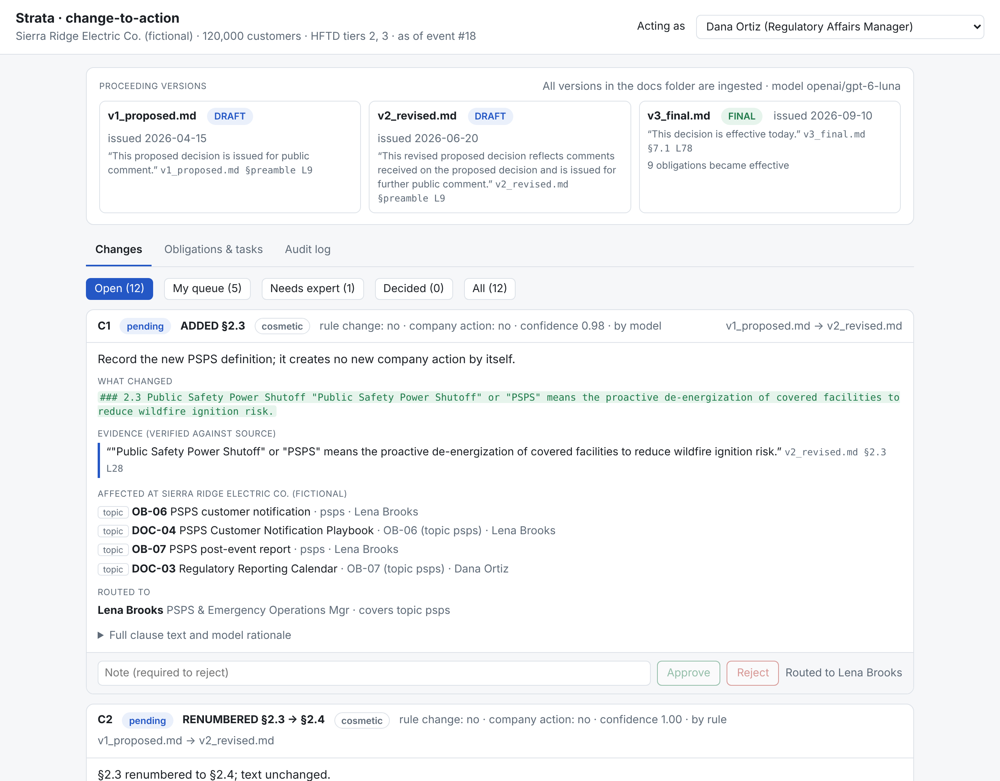
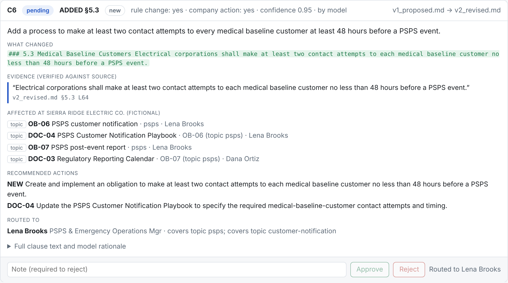
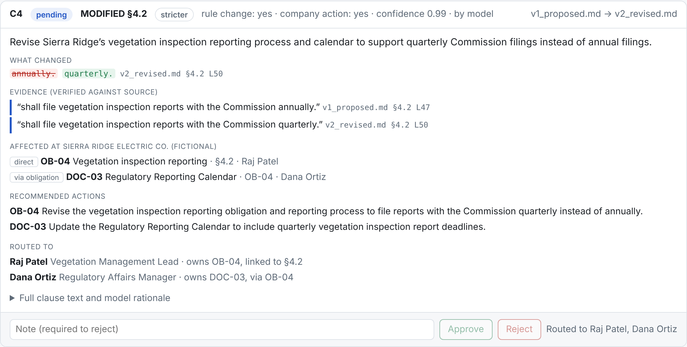
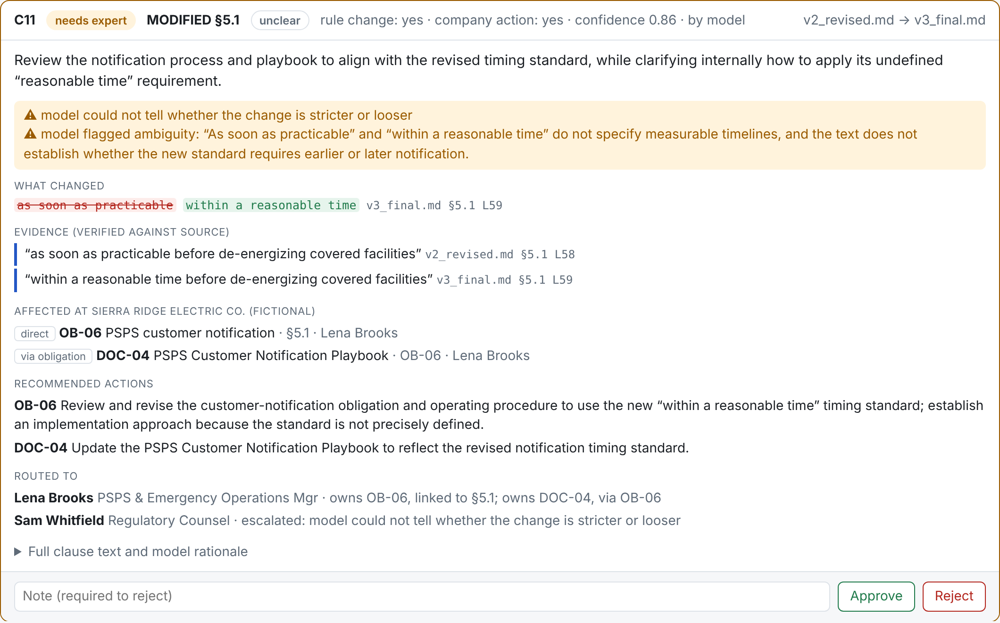
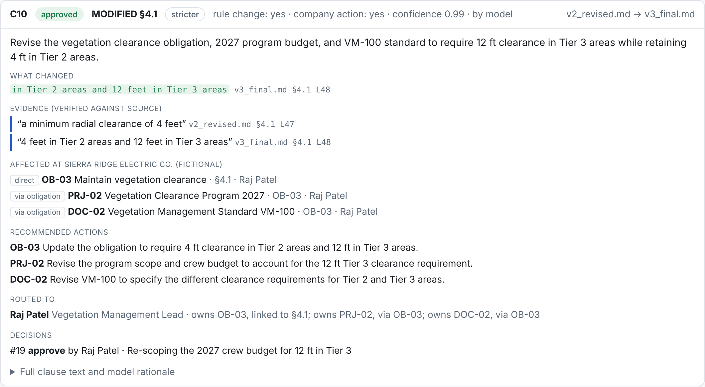
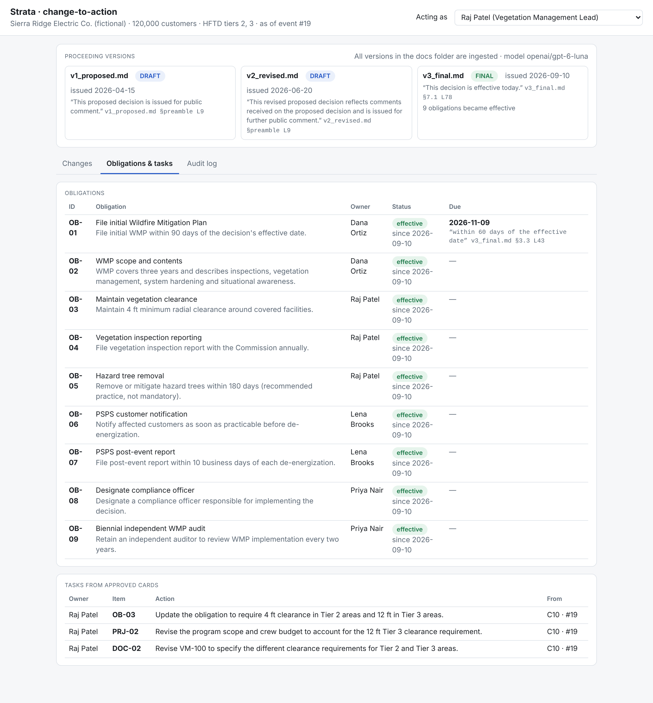
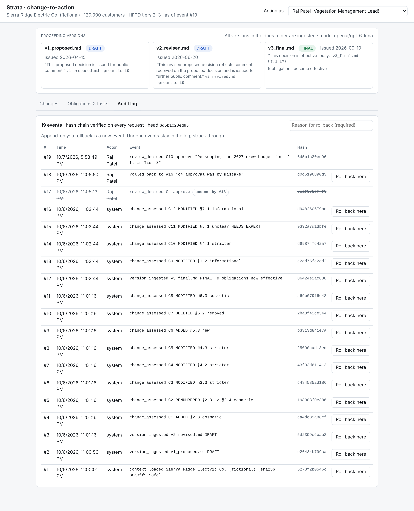

# UI screenshots

Taken from the real gpt-6-luna session in [`demo/events.jsonl`](../demo/events.jsonl): v1 → v2 → v3 ingested,
C4 approved by mistake and rolled back. For shots 6–8, one extra review (Raj Patel approving C10)
was added to a copy of that log to show tasks; `demo/events.jsonl` itself is unchanged.

### 1. Overview
Versions with DRAFT/FINAL and the quote that decided each; change cards with filters.

### 2. A modal shift: "should" → "shall" (§4.3)
Cited diff, verified evidence from both versions, the obligation/project/standard it hits, actions,
and the model's rationale: the project's 270-day target no longer meets a now-mandatory 180 days.

### 3. A new requirement with no existing obligation (§5.3)
Found by topic, proposed as a `NEW` obligation plus an update to the PSPS playbook, routed to the PSPS owner.

### 4. Routing enforced (§4.2, acting as Lena Brooks)
Buttons are disabled with the reason: the card is routed to Raj Patel and Dana Ortiz. The server enforces the same rule.

### 5. Escalated to counsel (§5.1, acting as Sam Whitfield)
"as soon as practicable" → "within a reasonable time": the model says it cannot tell stricter from looser,
so the card is `needs expert` and only counsel can decide it.

### 6. Approved card (§4.1, Raj Patel)
Decision recorded with the reviewer's note and event number.

### 7. Obligations and tasks
After the final decision, all obligations are effective; OB-01's due date is computed from the cited clause.
The approved card's actions became tasks for the item owners.

### 8. Audit log
Hash-chained, append-only. The mistaken C4 approval (#17) is struck through and marked "undone by #18";
the rollback itself is an event with its reason.

